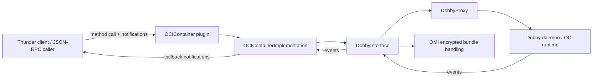
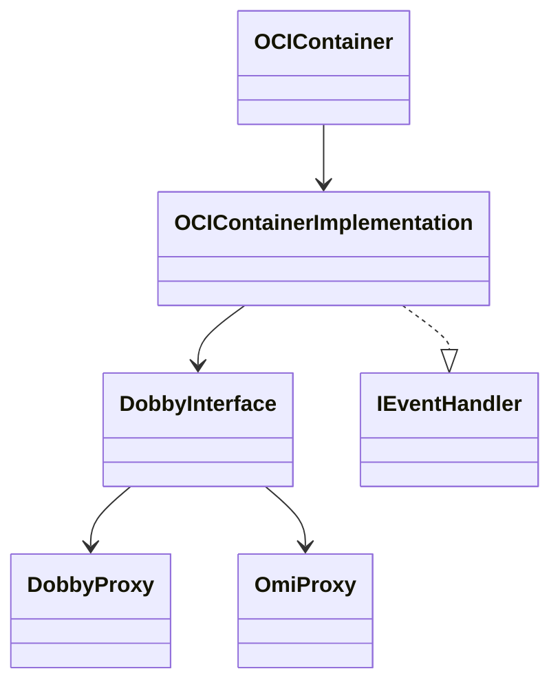
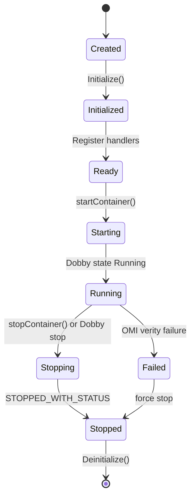
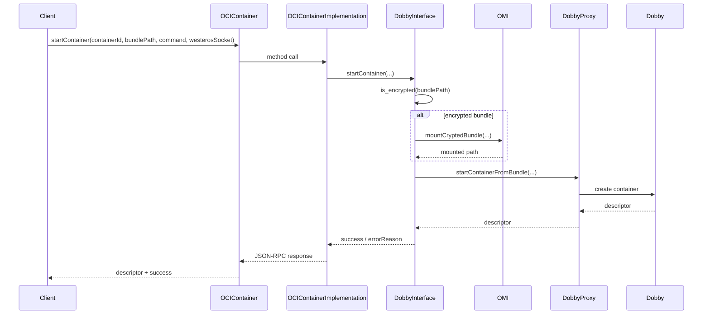

# OCIContainer Plugin Subsystem

This document describes the plugin subsystem in [plugin](../plugin), which exposes OCI container lifecycle capabilities to the Thunder JSON-RPC host and delegates execution to the Dobby runtime over the system D-Bus IPC layer.

## 1. High-Level Purpose & Architecture

### Role in ENT / RDK infrastructure
The plugin acts as the service boundary between the RDK / ENT runtime and the OCI container orchestration stack. The code in [plugin/OCIContainer.h](../plugin/OCIContainer.h), [plugin/OCIContainer.cpp](../plugin/OCIContainer.cpp), and [plugin/OCIContainerImplementation.cpp](../plugin/OCIContainerImplementation.cpp) shows a Thunder plugin named `org.rdk.OCIContainer` that registers methods such as `startContainer`, `stopContainer`, and `getContainerState`.

The real container control logic is delegated to [plugin/DobbyInterface.cpp](../plugin/DobbyInterface.cpp), which interacts with Dobby through `DobbyProxy` and with OMI for encrypted bundle mounting. This subsystem is therefore a bridge, not the runtime itself.

### Responsibilities
- Expose a JSON-RPC plugin interface to callers through Thunder
- Register and dispatch lifecycle notifications for container start/stop/failure/state change
- Map calls onto Dobby operations such as create, stop, pause, resume, hibernate, mount, and annotation
- Resolve container IDs to Dobby descriptors and vice versa
- Support encrypted bundle paths by using OMI mount/umount operations

### Interacting subsystems
- Thunder / plugin host: loads the plugin, routes method calls, and receives notifications
- Dobby: the OCI container runtime used to create and manage containers
- OMI: used when a bundle is encrypted and must be mounted before startup and unmounted on stop
- System D-Bus / IPC service: used by the Dobby client layer

### What it does not do
This code does not:
- implement a general-purpose OCI lifecycle engine from scratch
- provide image builds or bundle generation
- own bundle provisioning or host image management
- perform full container network policy or storage admin beyond Dobby calls

The repository does not contain an actual OCI runtime implementation; the plugin is clearly a service wrapper around Dobby and the underlying system IPC stack.

## 2. Architectural Overview

### Major components and interactions
1. `OCIContainer` is the Thunder plugin entrypoint.
2. `OCIContainerImplementation` is the actual implementation object used by the plugin host.
3. `DobbyInterface` mediates Dobby API calls and event listeners.
4. `IEventHandler` defines the callback interface used to report container lifecycle events.
5. External Dobby and OMI libraries are reached via `DobbyProxy` and `omi::OmiProxy`.

### High-level diagram


## 3. Code Organization (Folder & File-Level)

### Repository structure walkthrough for the subsystem
The plugin subsystem is located under [plugin](../plugin). The key files are:

- [plugin/CMakeLists.txt](../plugin/CMakeLists.txt): build target, dependency discovery, and install rules
- [plugin/OCIContainer.h](../plugin/OCIContainer.h): Thunder plugin entrypoint and callback notification bridge
- [plugin/OCIContainer.cpp](../plugin/OCIContainer.cpp): initialization, registration, and teardown logic
- [plugin/OCIContainerImplementation.h](../plugin/OCIContainerImplementation.h): service contract implementation and event dispatcher
- [plugin/OCIContainerImplementation.cpp](../plugin/OCIContainerImplementation.cpp): method routing and event dispatch
- [plugin/DobbyInterface.h](../plugin/DobbyInterface.h): high-level Dobby operations and listener state
- [plugin/DobbyInterface.cpp](../plugin/DobbyInterface.cpp): container lifecycle behavior and event translation
- [plugin/IEventHandler.h](../plugin/IEventHandler.h): event callback contract
- [plugin/Module.h](../plugin/Module.h) and [plugin/Module.cpp](../plugin/Module.cpp): module declarations used by the plugin loader
- [plugin/OCIContainer.config](../plugin/OCIContainer.config) and [plugin/OCIContainer.conf.in](../plugin/OCIContainer.conf.in): service metadata for autostart and callsign
- [plugin/test](../plugin/test): integration-style test scripts for runtime validation
- [Tests/L1Tests/tests/test_OCIContainer.cpp](../Tests/L1Tests/tests/test_OCIContainer.cpp): unit/integration-style assertions for the plugin methods

### File-by-file breakdown

#### [plugin/OCIContainer.h](../plugin/OCIContainer.h)
Purpose: defines the entry Thunder plugin class and its notification sink.

Notable members:
- `Initialize(PluginHost::IShell* service)`
- `Deinitialize(PluginHost::IShell* service)`
- `Information() const`
- `Notification` inner class that forwards events from `Exchange::IOCIContainer::INotification`

#### [plugin/OCIContainer.cpp](../plugin/OCIContainer.cpp)
Purpose: creates the implementation instance and registers it with the Thunder service.

Key behavior:
- `SERVICE_REGISTRATION(OCIContainer, ...)`
- sets `OCIContainer::sInstance`
- loads an implementation object via `Root<Exchange::IOCIContainer>`
- calls `Exchange::JOCIContainer::Register(*this, mOCIContainerImplementation)`
- unregisters and releases the service on shutdown

#### [plugin/OCIContainerImplementation.h](../plugin/OCIContainerImplementation.h)
Purpose: implements the actual plugin API contract and event dispatch.

Key methods:
- `Register` / `Unregister`
- `ListContainers`
- `GetContainerInfo`
- `GetContainerState`
- `StartContainer`
- `StartContainerFromDobbySpec`
- `StopContainer`
- `PauseContainer` / `ResumeContainer`
- `HibernateContainer` / `WakeupContainer`
- `ExecuteCommand`
- `Annotate` / `RemoveAnnotation`
- `Mount` / `Unmount`

The class also includes a `Job` helper for worker-pool event dispatching.

#### [plugin/DobbyInterface.h](../plugin/DobbyInterface.h)
Purpose: wraps the Dobby API and lifecycle event handling.

Key responsibilities:
- establish IPC service and Dobby proxy
- call Dobby methods for container operations
- translate Dobby states to the `Exchange::IOCIContainer::ContainerState` enum
- expose callbacks for container start, stop, state-change, and OMI verity failures

#### [plugin/DobbyInterface.cpp](../plugin/DobbyInterface.cpp)
Purpose: implements the concrete Dobby interaction and event callbacks.

Key logic:
- `initialize()` creates the IPC service and registers listeners
- `terminate()` removes listeners
- `startContainer()` detects encrypted bundles and calls `mOmiProxy->mountCryptedBundle()`
- `GetContainerDescriptorFromId()` and `GetContainerIdFromDescriptor()` translate names to descriptors
- `onContainerStateChanged()` translates Dobby states to API states
- `onVerityFailed()` triggers `OnContainerFailed` and force-stops the container

## 4. Class & Interface Documentation

### `OCIContainer`
Location: [plugin/OCIContainer.h](../plugin/OCIContainer.h) and [plugin/OCIContainer.cpp](../plugin/OCIContainer.cpp)

Responsibilities:
- Thunder plugin facade
- registers the JSON-RPC service name `org.rdk.OCIContainer`
- constructs the implementation object and exposes aggregated interface methods
- routes remote connection notifications to deactivation handling

Members:
- `SERVICE_NAME`
- `sInstance`
- `_service`
- `mConnectionId`
- `mOCIContainerImplementation`
- `mOCIContainerNotification`

Lifecycle:
- constructed during plugin load
- `Initialize()` creates the implementation and registers JSON-RPC methods
- `Deinitialize()` unregisters listeners, releases the implementation, and cleans up connection state

### `OCIContainerImplementation`
Location: [plugin/OCIContainerImplementation.h](../plugin/OCIContainerImplementation.h) and [plugin/OCIContainerImplementation.cpp](../plugin/OCIContainerImplementation.cpp)

Responsibilities:
- implement `Exchange::IOCIContainer`
- forward method calls to `DobbyInterface`
- maintain the callback registry of `INotification` clients
- dispatch events via a worker job to avoid blocking the caller thread

Representative code:
```cpp
class OCIContainerImplementation : public Exchange::IOCIContainer, public IEventHandler
{
    public:
        virtual Core::hresult ListContainers(string& containers, bool& success, string& errorReason) override;
        virtual Core::hresult GetContainerInfo(const string& containerId, string& info, bool& success, string& errorReason) override;
        virtual Core::hresult StartContainer(const string& containerId, const string& bundlePath, const string& command, const string& westerosSocket, int32_t& descriptor, bool& success, string& errorReason) override;
        ...
};
```

The event pipeline is explicit in the dispatch flow:
```cpp
void OCIContainerImplementation::dispatchEvent(EventNames event, const JsonObject &params)
{
    Core::IWorkerPool::Instance().Submit(Job::Create(this, event, params));
}
```

### `DobbyInterface`
Location: [plugin/DobbyInterface.h](../plugin/DobbyInterface.h) and [plugin/DobbyInterface.cpp](../plugin/DobbyInterface.cpp)

Responsibilities:
- create and manage a `DobbyProxy` bound to the Dobby service
- translate OCI container IDs into Dobby descriptors
- execute container operations such as start/stop/pause/resume/execute/annotate
- listen for Dobby start/stop/state-change callbacks
- emit plugin-level events through `IEventHandler`

Representative code:
```cpp
bool DobbyInterface::initialize(IEventHandler* eventHandler)
{
    mEventHandler = eventHandler;
    mIpcService = AI_IPC::createIpcService("unix:path=/var/run/dbus/system_bus_socket", "com.sky.dobby.thunder");
    mDobbyProxy = std::make_shared<DobbyProxy>(mIpcService, DOBBY_SERVICE, DOBBY_OBJECT);
    mStandardListenerId = mDobbyProxy->registerListener(stateListenerStandard, static_cast<const void*>(this));
    mEventListenerId = mDobbyProxy->registerListenerWithStatus(stateListener, static_cast<const void*>(this));
    mOmiProxy = std::make_shared<omi::OmiProxy>();
    mOmiListenerId = mOmiProxy->registerListener(omiErrorListener, static_cast<const void*>(this));
    return true;
}
```

### `IEventHandler`
Location: [plugin/IEventHandler.h](../plugin/IEventHandler.h)

This is the callback interface used by `DobbyInterface` to notify the implementation object about lifecycle changes.

```cpp
class IEventHandler
{
    public:
        virtual void onContainerStarted(JsonObject& data) = 0;
        virtual void onContainerStopped(JsonObject& data) = 0;
        virtual void onContainerFailed(JsonObject& data) = 0;
        virtual void onContainerStateChange(JsonObject& data) = 0;
};
```

### Relationship notes
The code is clearly layered:
- Thunder plugin -> implementation -> Dobby wrapper -> external runtime
- event callbacks travel back through the same chain in reverse

The implementation is not using a repository-defined abstract factory or service locator beyond the plugin load path; most runtime logic is direct method calls on `DobbyProxy`.

## 5. Configuration & Build Integration

### Configuration files
The config is intentionally minimal:

From [plugin/OCIContainer.config](../plugin/OCIContainer.config):
```ini
set (autostart true)
set (preconditions Platform)
set (callsign "org.rdk.OCIContainer")
```

From [plugin/OCIContainer.conf.in](../plugin/OCIContainer.conf.in):
```ini
precondition = ["Platform"]
callsign = "org.rdk.OCIContainer"
autostart = "true"
startuporder = "@PLUGIN_OCICONTAINER_STARTUPORDER@"
```

These settings show the plugin is started automatically and requires the platform precondition.

### Build system info and flags
From [plugin/CMakeLists.txt](../plugin/CMakeLists.txt):
```cmake
set(PLUGIN_NAME OCIContainer)
set(MODULE_NAME ${NAMESPACE}${PLUGIN_NAME})
set(PLUGIN_OCICONTAINER_STARTUPORDER "" CACHE STRING "To configure startup order of OCIContainer plugin")

find_package(Dobby CONFIG)
find_package(${NAMESPACE}Helpers REQUIRED)
pkg_search_module(OMI_CLIENT "omiclientlib")

add_definitions(-DOCICONTAINER_API_VERSION_NUMBER_MAJOR=1)
add_definitions(-DOCICONTAINER_API_VERSION_NUMBER_MINOR=0)
add_definitions(-DOCICONTAINER_API_VERSION_NUMBER_PATCH=0)
```

The target links against:
- Dobby libraries
- WPEFramework plugin and definition libraries
- systemd library for D-Bus support
- `OMI_CLIENT_LIBRARIES`
- helper libraries

Important caveat: the code comments note a temporary Dobby define fix:
```cmake
# Temporary fix to get defines in Dobby. Will be removed later.
add_definitions( -DRDK )
```
This indicates the build assumes Dobby headers may require a compatibility define.

## 6. Internal Workflows & Execution Flow

### Initialization path
From [plugin/OCIContainer.cpp](../plugin/OCIContainer.cpp):
```cpp
mOCIContainerImplementation = _service->Root<Exchange::IOCIContainer>(mConnectionId, 5000, _T("OCIContainerImplementation"));
if(nullptr != mOCIContainerImplementation)
{
    mOCIContainerImplementation->Register(&mOCIContainerNotification);
    Exchange::JOCIContainer::Register(*this, mOCIContainerImplementation);
}
```

This means the plugin loads the out-of-process implementation and registers it for notification dispatch.

### Request flow
The request flow is straightforward:
1. A client calls a JSON-RPC method exposed by the Thunder plugin.
2. `OCIContainer` delegates to the implementation object.
3. `OCIContainerImplementation` forwards directly to `DobbyInterface`.
4. For operations on existing containers, `DobbyInterface` resolves the container ID to a Dobby descriptor before invoking Dobby; start operations pass the new ID and bundle/spec directly to Dobby.
5. The result is returned as `success` and `errorReason` values.

### Start-container flow
The concrete implementation in [plugin/DobbyInterface.cpp](../plugin/DobbyInterface.cpp) shows the encrypted bundle branch:
```cpp
const bool encrypted = is_encrypted(bundlePath);

if (encrypted && !mOmiProxy->mountCryptedBundle(id,
                                   bundlePath + "rootfs.img",
                                   bundlePath + "config.json.jwt",
                                   containerPath))
{
    LOGERR("Failed to start container - sync mount request to omi failed.");
    errorReason = "mount failed";
    return false;
}
```

Then the actual start call is issued using `startContainerFromBundle` with either the plain bundle path or the OMI-mounted path.

### Event flow and shutdown
The event flow uses Dobby listeners and callbacks:
- `stateListenerStandard` handles `Running` state and calls `onContainerStarted()`
- `stateListener` handles `STOPPED_WITH_STATUS` and calls `onContainerStopped()`
- `omiErrorListener` responds to `verityFailed` and calls `onVerityFailed()`

A stop event includes cleanup for encrypted bundles:
```cpp
if (!mOmiProxy->umountCryptedBundle(name))
{
    LOGERR("Failed to umount container %s - sync unmount request to omi failed.", name.c_str());
}
```

### Error handling
The code follows a consistent pattern:
- guard for `nullptr == mDobbyProxy`
- if lookup of descriptor fails, return false
- if Dobby operation returns error, log `LOGERR` and return false
- emit `OnContainerFailed` when verity checking fails

A missing or ambiguous area is the exact semantics of the `Mount` and `Unmount` operations. In [plugin/DobbyInterface.cpp](../plugin/DobbyInterface.cpp), `mount()` accepts `type` and `options` but currently ignores both: it creates an empty `mountFlags` vector and passes an empty final argument to Dobby; the code comment says `//TODO Populate mount flags and data`. Therefore callers cannot rely on those API inputs affecting the mount until this is implemented.

## 7. Diagrams & Visual Aids

### Class relationship diagram


### Event lifecycle diagram


### Sequence diagram: start container


## 8. Testing & Quality Analysis

### Existing tests
The repository contains both unit-level and script-level validation:

- [Tests/L1Tests/tests/test_OCIContainer.cpp](../Tests/L1Tests/tests/test_OCIContainer.cpp): verifies registered methods and method invocation behavior for list, state, info, start, stop, pause, resume, and execute command paths
- [Tests/L2Tests/tests/OCIContainer_L2Test.cpp](../Tests/L2Tests/tests/OCIContainer_L2Test.cpp): exercises COM-RPC/JSON-RPC API paths, state translation, and lifecycle event notifications
- [plugin/test/thunder-ocicontainer-test.js](../plugin/test/thunder-ocicontainer-test.js): actual Thunder JSON-RPC smoke test exercising the plugin against a live service
- [plugin/test/ociContainerTest.sh](../plugin/test/ociContainerTest.sh): shell-level test loader for Dobby specs under [plugin/test/DobbySpecs](../plugin/test/DobbySpecs)

### Quality observations
The L1 tests cover the happy path of method registration and direct Dobby interactions. They confirm the contract shape and several main operations.

### Missing coverage and gaps
This repository does not appear to include direct tests for:
- encrypted bundle mount path in `startContainer()` (stop-time unmount cleanup and verity-failure handling are covered)
- `stateListenerStandard` vs `stateListener` callback split
- worker-pool event dispatch and notification fan-out concurrency
- failure modes when `mDobbyProxy` is null
- worker-pool event dispatch and notification fan-out concurrency
- failure modes when `mDobbyProxy` is null or the container cannot be resolved by ID

### Suggested test additions
Suggested follow-up tests:
1. verify an encrypted bundle triggers OMI mount and OMI unmount cleanup
2. verify `onVerityFailed()` emits `OnContainerFailed` and force-stops the container
3. verify `GetContainerDescriptorFromId()` works with both descriptor and string ID inputs
4. verify `startContainerFromDobbySpec()` handles empty `command` / `westerosSocket` values correctly
5. verify `ContainerState` translation for all Dobby state values:
   `Invalid`, `Starting`, `Running`, `Stopping`, `Paused`, `Stopped`, `Hibernating`, `Hibernated`, `Awakening`

## 9. Beginner-to-Expert Teaching Mode

### Must know first
If you are learning this subsystem, focus on three things first:
1. The public interface is the Thunder plugin `org.rdk.OCIContainer`.
2. The runtime decisions are delegated to `DobbyInterface`, not implemented inline in the public plugin wrapper.
3. The state translation pattern is: Dobby callback -> `DobbyInterface` -> `OCIContainerImplementation` -> Thunder event callback.

This is the core mental model for this codebase.

### Learning path
For beginners:
- start with [plugin/OCIContainer.cpp](../plugin/OCIContainer.cpp): plugin registration and lifecycle
- read [plugin/OCIContainerImplementation.cpp](../plugin/OCIContainerImplementation.cpp): method routing logic
- inspect [plugin/DobbyInterface.cpp](../plugin/DobbyInterface.cpp): actual runtime calls

For intermediate learners:
- compare the event listener callbacks in `stateListenerStandard`, `stateListener`, and `omiErrorListener`
- study the descriptor translation helpers `GetContainerDescriptorFromId()` and `GetContainerIdFromDescriptor()`
- review how `is_encrypted()` enables an alternate startup path using OMI

For advanced learners:
- trace the full lifecycle across D-Bus, Dobby, and OMI interactions
- reason about how event ordering matters during stop and failure transitions
- inspect how the code handles `null` / empty optional command or socket arguments and why those branches exist

## Missing / ambiguous facts
The repository is quite clear about the main plugin and Dobby integration, but a few externally-defined details are missing from the workspace itself:

- The exact JSON-RPC event schema is not fully declared in the repository; the generated Thunder APIs appear to be in external interface definitions rather than this workspace.
- The `Mount` logic is incomplete in code and marked with a TODO in [plugin/DobbyInterface.cpp](../plugin/DobbyInterface.cpp).
- The OMI/crypted bundle handling is present but not fully described in this repo; the exact policy for mount flags and verity behavior is only partially visible here.

If you need a strict contract definition for the interface or the Dobby event payloads beyond what is visible in this repository, that information is missing from the current workspace and should be sourced from the external Thunder / Dobby API definitions.

## Summary
This subsystem is a small but critical bridge between the Thunder service layer and the Dobby container runtime. Its responsibilities are clear: register container operations, translate them into Dobby calls, manage state change notifications, and handle encrypted bundles via OMI. It is a good example of a thin service adapter rather than a full runtime implementation.
